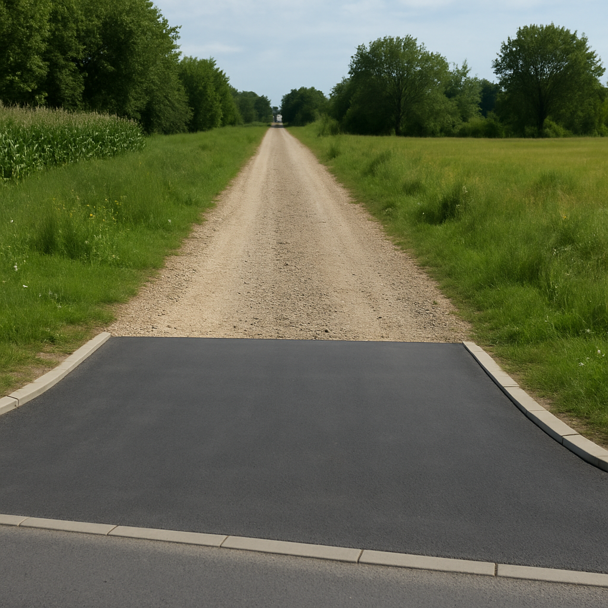

# Земљани пут
**Грунтовая дорога** — это дорога без устроенного дорожного покрытия, даже если на съезде к другой дороге покрытие имеется.

> **zemljani put** je put bez izgrađenog kolovoznog zastora, pa i kada na priključku na drugi put ima izgrađen kolovozni zastor,
> 
>[ZAKON O BEZBEDNOSTI SAOBRAĆAJA NA PUTEVIMA, Član 7]()

